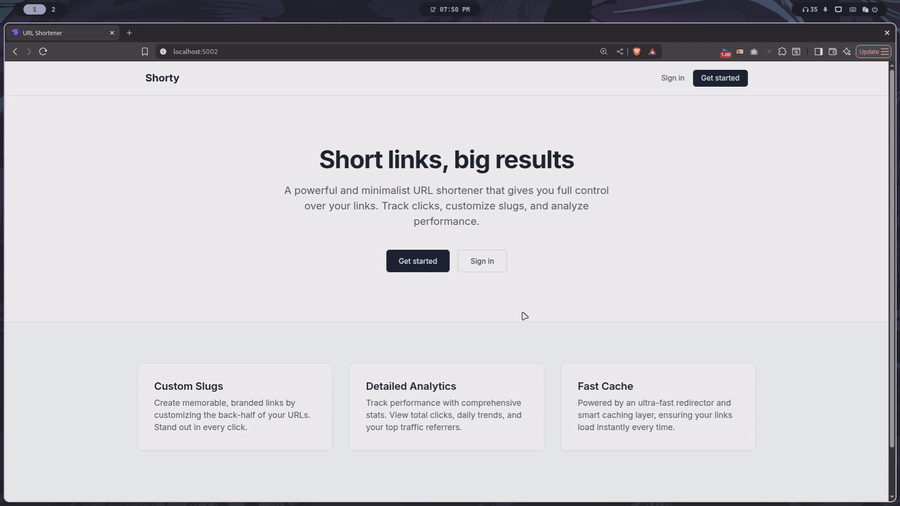
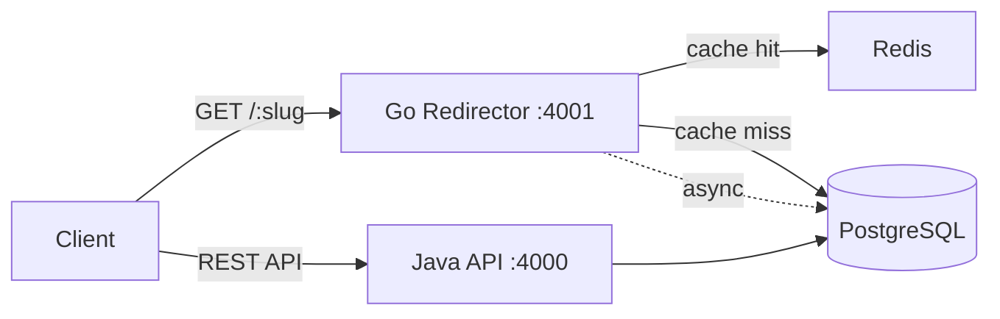
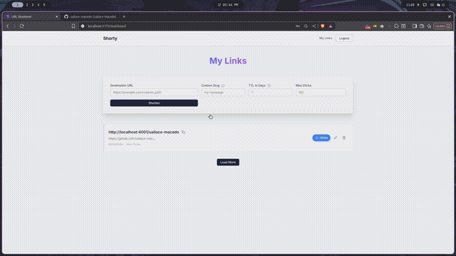
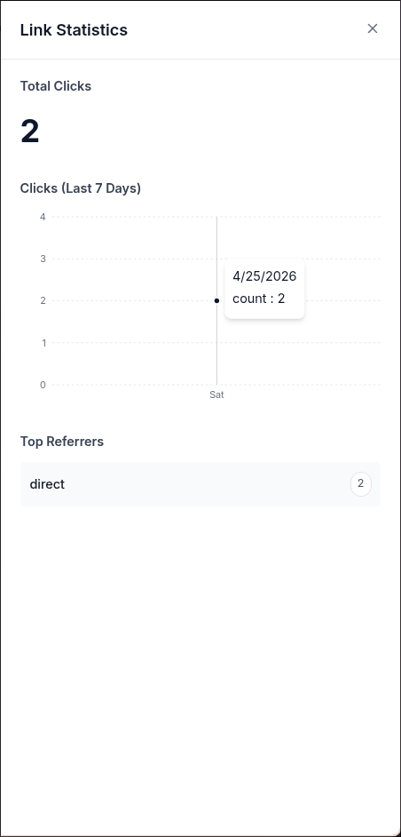

# 🔗 Encurtador de URLs


Encurtador de URLs com autenticação, analytics de cliques e cache distribuído.
Dois serviços independentes — Go cuida dos redirecionamentos, Java cuida do restante.



## Arquitetura



**Go** é responsável pelo redirecionamento, precisa ser rápido. Busca no Redis
primeiro e cai no PostgreSQL apenas em caso de cache miss. O registro de cliques
acontece de forma assíncrona via goroutine, sem adicionar latência ao redirect.

**Java + Spring Boot** é responsável por tudo que envolve regras de negócio:
autenticação, gerenciamento de URLs e analytics. O JWT é armazenado em cookie
HttpOnly, nunca exposto ao JavaScript. Proteção CSRF via header `X-XSRF-TOKEN`
em todas as requisições mutantes.

A separação é intencional. O endpoint de redirecionamento tem requisitos de
latência que não combinam com a complexidade de um serviço de autenticação.

## Demo

### Autenticação e criação de URL


### Analytics



## Funcionalidades

- Encurtamento com slug gerado automaticamente (Base62) ou personalizado
- TTL configurável por link e limite opcional de cliques
- Autenticação JWT via cookie HttpOnly + proteção CSRF
- Cache no Redis com fallback automático para o PostgreSQL
- Rate limiting por IP no serviço de redirecionamento
- Detecção de bots (redirecionados mas não contabilizados)
- Analytics de cliques: total, cliques por dia, top referrers
- Anonimização de IP antes do armazenamento (último octeto zerado)

## Stack

| Serviço | Tecnologia |
|---|---|
| Redirector | Go, Gin, sqlx |
| API | Java 21, Spring Boot, Spring Security |
| Cache | Redis 7 |
| Banco de dados | PostgreSQL 16 |
| Frontend | React, Vite, TypeScript, Zustand |
| Infra | Docker, Docker Compose |

## Como rodar

**Pré-requisito:** Docker e Docker Compose instalados.

```bash
git clone https://github.com/uallace-macedo/url-shortener
cd url-shortener
cp .env.example .env
docker compose up --build
```

| Serviço | URL |
|---|---|
| Frontend | http://localhost:3000 |
| Java API | http://localhost:4000 |
| Go Redirector | http://localhost:4001 |

## Endpoints

**Auth**
```
POST /auth/register   { name, email, password }
POST /auth/login      { email, password }
POST /auth/logout
```

**URLs**
```
GET    /urls
POST   /urls          { url, custom_slug?, expires_at?, max_click_count? }
PATCH  /urls/:id      { url }
DELETE /urls/:id
GET    /urls/:id/stats
```

**Redirect**
```
GET /:slug   → 302 Temporary Redirect
```

## Decisões técnicas

**Por que dois serviços?**  
Separação de responsabilidades com perfis de performance diferentes. O caminho
de redirecionamento é read-heavy e sensível à latência. A API é write-heavy com
regras de negócio complexas. Separados, cada serviço pode ser escalado e
otimizado de forma independente.

**Por que cookie HttpOnly em vez de localStorage?**  
Tokens no localStorage são acessíveis via JavaScript e vulneráveis a XSS.
Cookies HttpOnly são invisíveis para scripts — o navegador os gerencia
automaticamente. Combinado com proteção CSRF, essa é a abordagem correta
para autenticação web.

**Por que 302 em vez de 301?**  
301 é cacheado permanentemente pelo navegador. Se o destino de uma URL for
atualizado, browsers que cachearam o 301 antigo nunca veriam a mudança.
O 302 garante que cada redirecionamento passe pelo servidor.

**Por que registro de clique assíncrono?**  
O usuário não deve esperar pelo analytics. Uma goroutine cuida do INSERT
depois que a resposta de redirect já foi enviada, o clique é registrado
sem impactar a performance percebida.

**Por que Base62?**  
Gera slugs curtos usando apenas caracteres alfanuméricos, seguros para URLs.
Um slug de 4 caracteres em Base62 oferece mais de 14 milhões de combinações.

## Licença

MIT